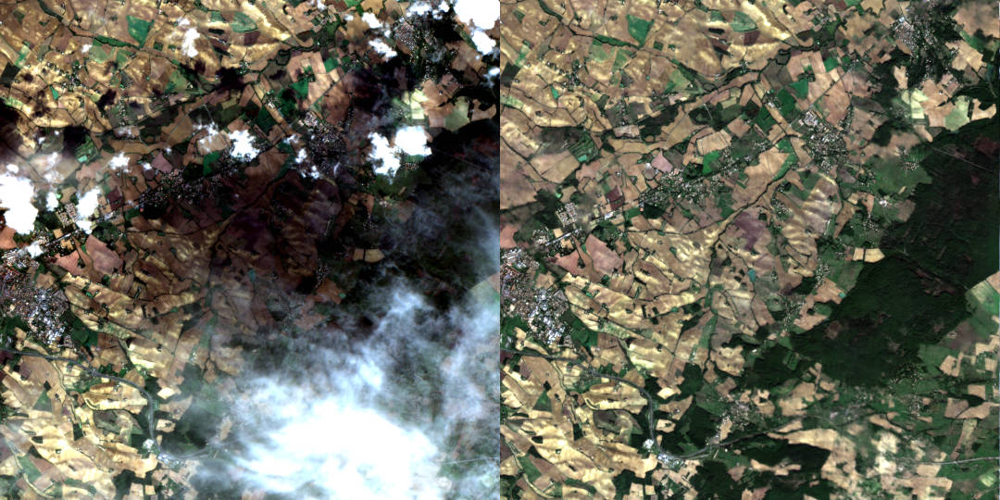
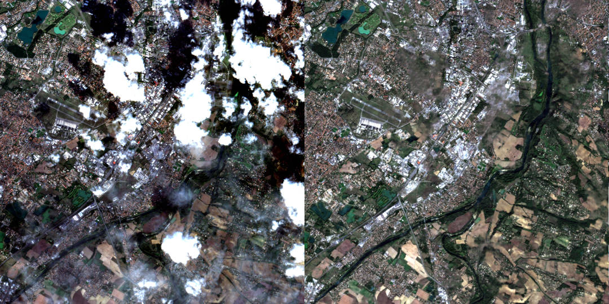
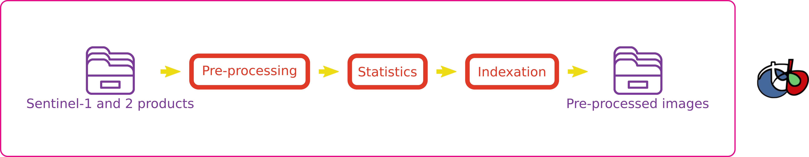
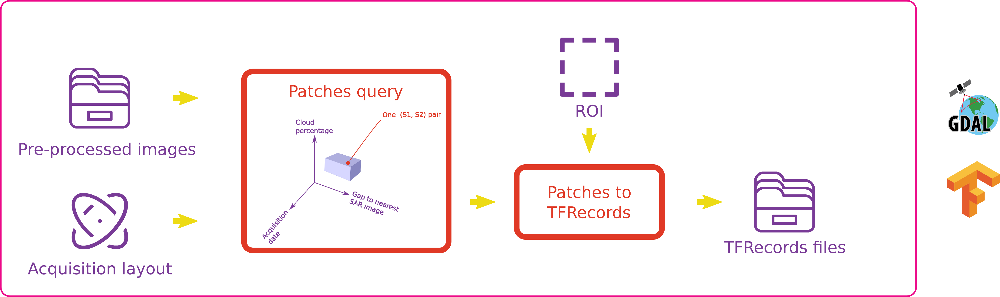
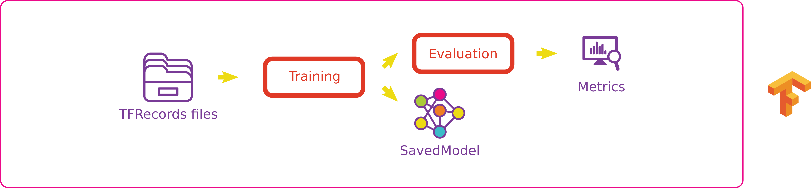
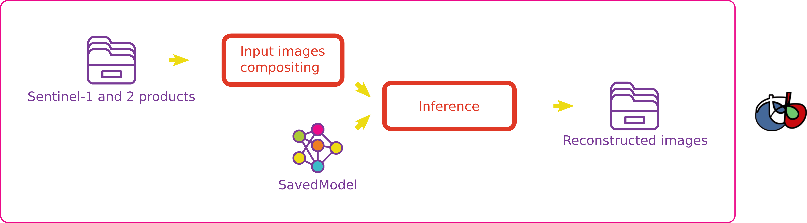

# Decloud

Decloud enables the training and inference of various neural networks to remove clouds in optical images.

Representative illustrations:




*Examples of de-clouded Sentinel-2 images using the single date SAR/Optical U-Net model.*

## Cite

```
@article{cresson2022clouds,
  title={Comparison of convolutional neural networks for cloudy optical images reconstruction from single or multitemporal joint SAR and optical images},
  author={Cresson, R., Narcon, N., Gaetano, R., Dupuis A., Tanguy, Y., May, S., Commandre, B.},
  journal={arXiv preprint arXiv:2204.00424},
  year={2022}
}
```

https://doi.org/10.48550/arXiv.2204.00424

## Quickstart: Run a pre-trained model
Some pre-trained models are available at this [url](https://nextcloud.inrae.fr/s/DEy4PgR2igSQKKH). 

The easiest way to run a model is to run the timeseries processor such as: 

```
python production/meraner_timeseries_processor.py
        --s2_dir  S2_PREPARE/T31TCJ 
        --s1_dir  S1_PREPARE/T31TCJ
        --model   merunet_occitanie_pretrained/
        --dem     DEM_PREPARE/T31TCJ.tif
        --out_dir meraner_timeseries/
# Optional arguments:
        --write_intermediate --overwrite
        --start 2018-01-01 --end 2018-12-31 
        --ulx 306000 --uly 4895000 --lrx 320000 --lry 4888000
```

You can find more info on available models and how to use these models [here](doc/pretrained_models.md)


## Advanced usage: Train you own models

1. Prepare the data: convert Sentinel-1 and Sentinel-2 images in the right format (see the [documentation](doc/user_doc.md#Part-A:-data-preparation)).

2. Create some *Acquisition Layouts* (.json files) describing how the images are acquired, ROIs for training and validation sites, and generate some TFRecord files containing the samples.

3. Train the network of your choice. The network keys for input/output must match the keys of the previously generated TFRecord files.

4. Perform the inference on real world images.


More info [here](doc/user_doc.md).

## Contact

You can contact remi cresson (Remi Cresson at INRAE )


