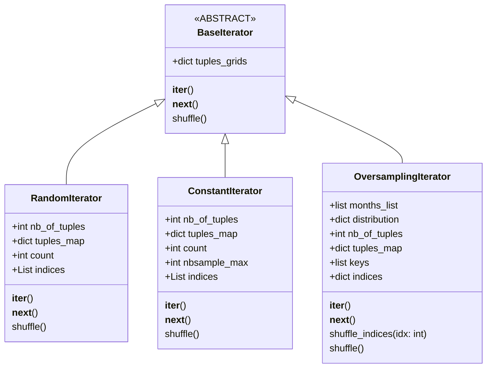

# Iterators classes

```mermaid
classDiagram
    BaseIterator <|-- RandomIterator
    BaseIterator <|-- ConstantIterator
    BaseIterator <|-- OversamplingIterator

    class BaseIterator{
      <<ABSTRACT>>
      +dict tuples_grids
      __iter__()
      __next__()
      shuffle()
    }

    class RandomIterator{
      +int nb_of_tuples
      +dict tuples_map
      +int count
      +List indices
      __iter__()
      __next__()
      shuffle()
    }

    class ConstantIterator{
      +int nb_of_tuples
      +dict tuples_map
      +int count
      +int nbsample_max
      +List indices
      __iter__()
      __next__()
      shuffle()
    }

    class OversamplingIterator{
      +list months_list
      +dict distribution
      +int nb_of_tuples
      +dict tuples_map
      +list keys
      +dict indices
      __iter__()
      __next__()
      shuffle_indices(idx: int)
      shuffle()
    }

```
