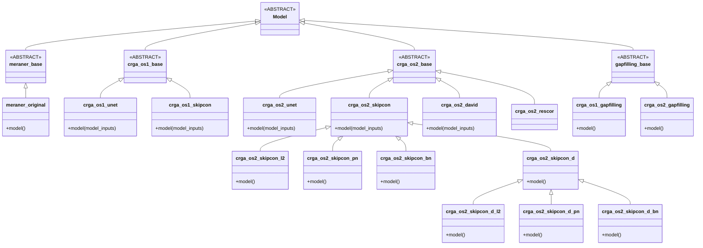

# Models classes

```mermaid

classDiagram
    Model <|-- crga_os1_base
    Model <|-- crga_os2_base
    Model <|-- gapfilling_base
    Model <|-- meraner_base

    meraner_base <|-- meraner_original

    crga_os1_base <|-- crga_os1_unet
    crga_os1_base <|-- crga_os1_skipcon

    crga_os2_base <|-- crga_os2_unet
    crga_os2_base <|-- crga_os2_skipcon
    crga_os2_base <|-- crga_os2_david
    crga_os2_base <|-- crga_os2_rescor

    crga_os2_skipcon <|-- crga_os2_skipcon_l2
    crga_os2_skipcon <|-- crga_os2_skipcon_pn
    crga_os2_skipcon <|-- crga_os2_skipcon_bn

    crga_os2_skipcon <|-- crga_os2_skipcon_d

    crga_os2_skipcon_d <|-- crga_os2_skipcon_d_l2
    crga_os2_skipcon_d <|-- crga_os2_skipcon_d_pn
    crga_os2_skipcon_d <|-- crga_os2_skipcon_d_bn

    gapfilling_base <|-- crga_os1_gapfilling
    gapfilling_base <|-- crga_os2_gapfilling


    class Model{
      <<ABSTRACT>>
    }
    
    class crga_os1_base{
      <<ABSTRACT>>
    }

    class crga_os2_base{
      <<ABSTRACT>>
    }

    class meraner_base{
      <<ABSTRACT>>
    }

    class crga_os1_unet{
      +model(model_inputs)
    }

    class crga_os1_skipcon{
      +model(model_inputs)
    }

    class crga_os2_unet{
      +model(model_inputs)
    }

    class crga_os2_skipcon{
      +model(model_inputs)
    }

    class crga_os2_david{
      +model(model_inputs)
    }

    class gapfilling_base{
      <<ABSTRACT>>
    }

    class crga_os1_gapfilling{
      +model()
    }

    class crga_os2_gapfilling{
      +model()
    }

    class crga_os2_skipcon_pn{
      +model()
    }

    class crga_os2_skipcon_bn{
      +model()
    }

    class crga_os2_skipcon_l2{
      +model()
    }

    class crga_os2_skipcon_d{
      +model()
    }

    class crga_os2_skipcon_d_l2{
      +model()
    }

    class crga_os2_skipcon_d_pn{
      +model()
    }

    class crga_os2_skipcon_d_bn{
      +model()
    }
    
    class meraner_original{
      +model()
    }

```

