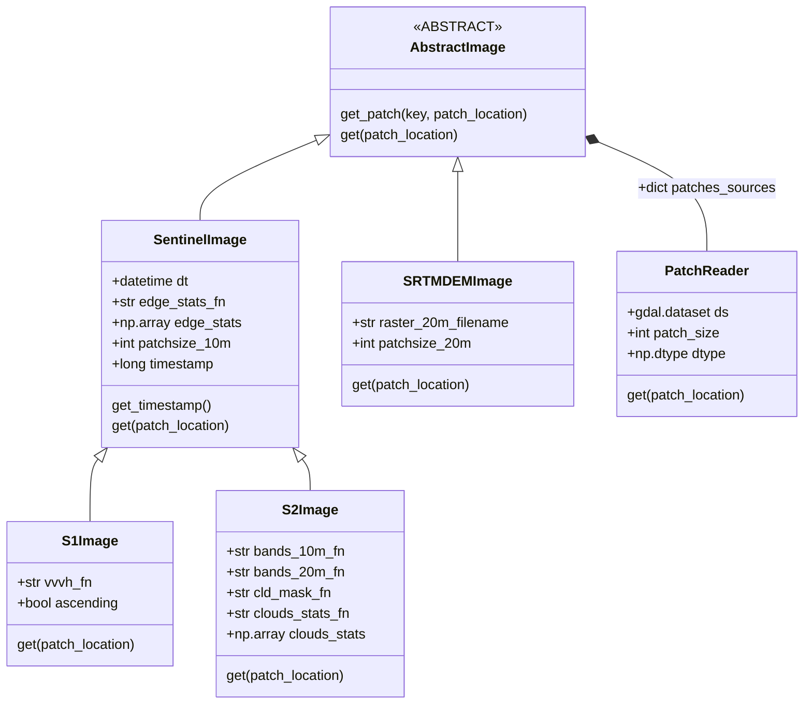

# Images classes

```mermaid

classDiagram
    AbstractImage <|-- SentinelImage
    AbstractImage <|-- SRTMDEMImage
    SentinelImage <|-- S1Image
    SentinelImage <|-- S2Image
    
    AbstractImage *-- PatchReader: +dict patches_sources
    
    class PatchReader{
      +gdal.dataset ds
      +int patch_size
      +np.dtype dtype
      
      get(patch_location)
    }

    class AbstractImage{
      <<ABSTRACT>>
      get_patch(key, patch_location)
      get(patch_location)
    }

    class SentinelImage{
        +datetime dt
        +str edge_stats_fn
        +np.array edge_stats
        +int patchsize_10m
        +long timestamp

        get_timestamp()
        get(patch_location)
    }

    class SRTMDEMImage{
        +str raster_20m_filename
        +int patchsize_20m

        get(patch_location)
    }

    class S1Image{
        +str vvvh_fn
        +bool ascending

        get(patch_location)
    }
    
    class S2Image{
        +str bands_10m_fn
        +str bands_20m_fn
        +str cld_mask_fn
        +str clouds_stats_fn
        +np.array clouds_stats

        get(patch_location)
    }

```
