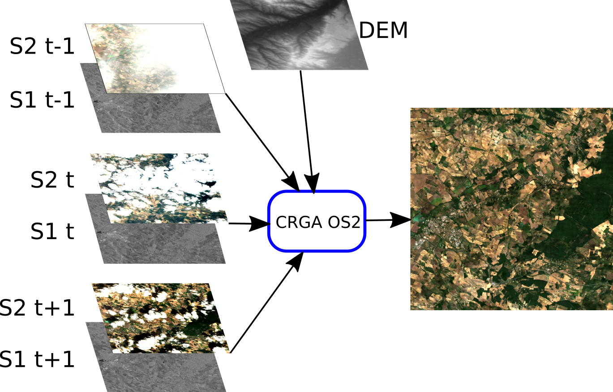
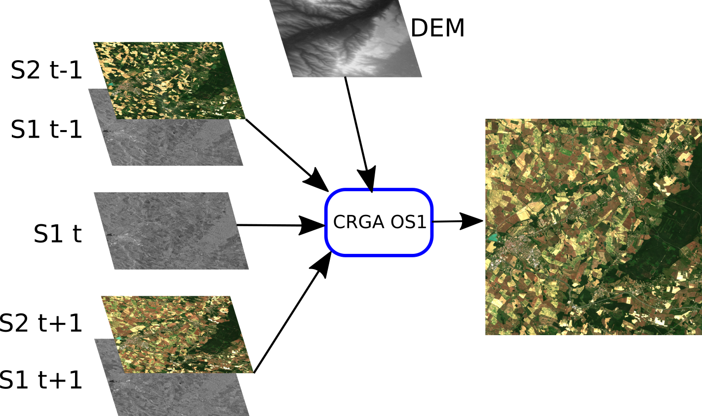
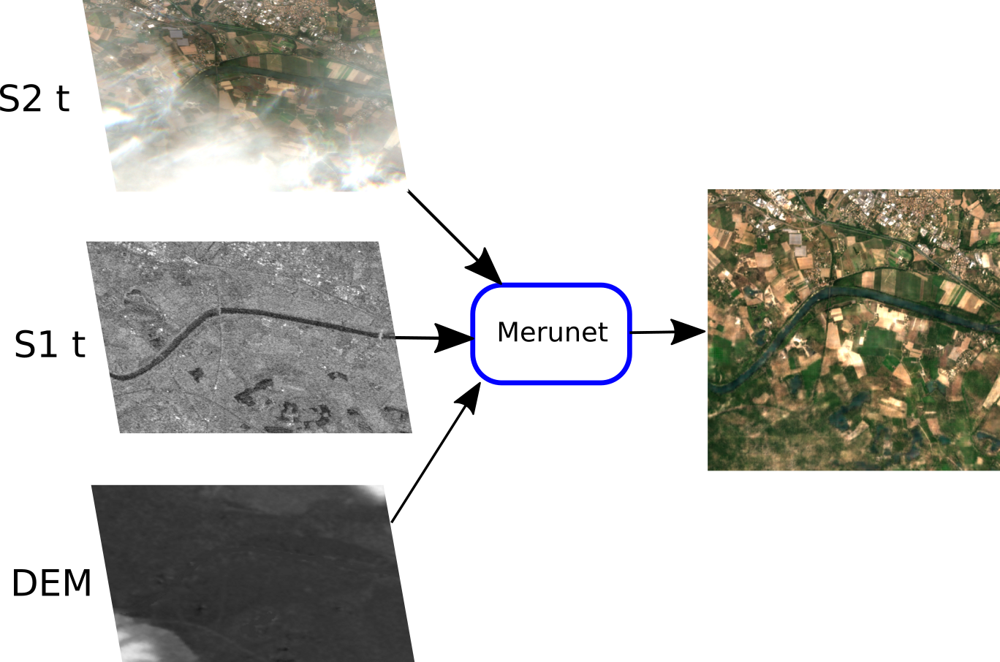
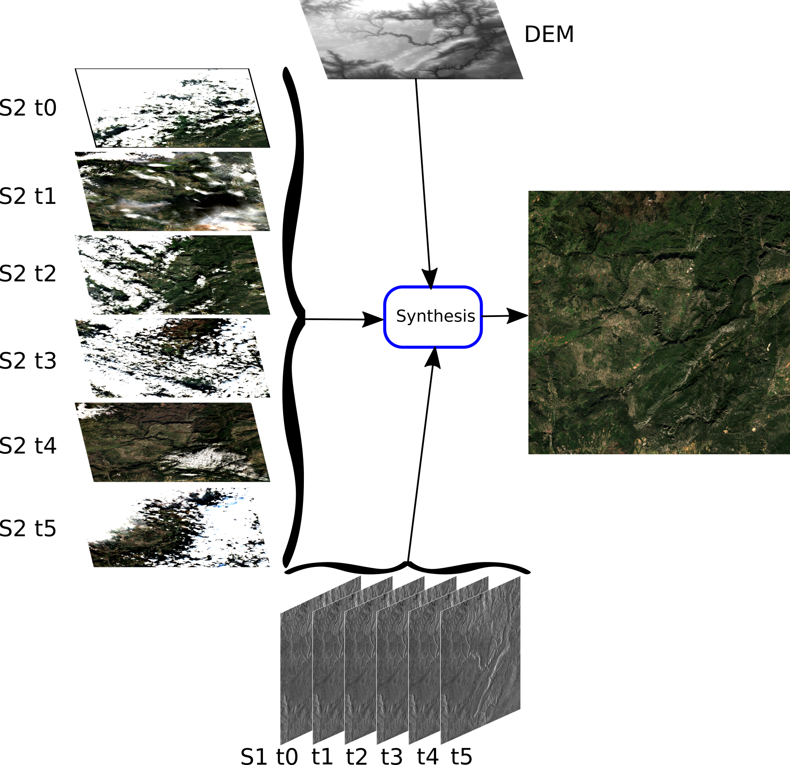
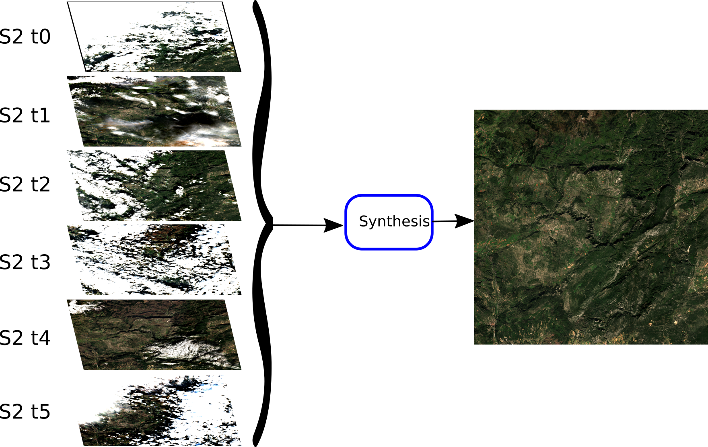

# Download
Models are located here: https://nextcloud.inrae.fr/s/DEy4PgR2igSQKKH

# Models

All models use Sentinel-2 and Sentinel-1 images as inputs. The inputs/output of each model architecture are presented below.

## CRGA OS2



## CRGA OS1



## Merunet: Meraner U-Net



## Monthly synthesis S2/S1


## Monthly synthesis S2


# Inputs

- Sentinel-1 SAR images, pre-processed using the S1Tiling OTB Remote Module
- Sentinel-2 optical images (L2 level), can be from the THEIA Land Data Center or from ESA scihub
- DEM: Digital Elevation Model, 20m resolution

# How to run a model

## Time series processor
This is the highest-level way of running the inference of a model. For example, you can run a CRGA model on a time series like this:

```
python production/crga_timeseries_processor.py
        --s2_dir  S2_PREPARE/T31TCJ
        --s1_dir  S1_PREPARE/T31TCJ
        --model   crga_os2_occitanie_pretrained/
        --dem     DEM_PREPARE/T31TCJ.tif
        --out_dir reconstructed_timeseries/
# Optional arguments:
        --write_intermediate --overwrite
        --start 2018-01-01 --end 2018-12-31
        --ulx 306000 --uly 4895000 --lrx 320000 --lry 4888000
```

## Processor
For instance, we use `crga_processor.py` to perform the inference of the *crga* models.
This program not only performs the inference, but also takes care of preparing the right input images to feed the model, and also the post-processing steps (like removing inferred no-data pixels).
It is built exclusively using OTB application pipelines, and is fully streamable (no limitation on images size).

Below is an example of use : 

```bash
python production/crga_processor.py \
--il_s1before \
  /data/s1b_31TEJ_vvvh_DES_139_20201001txxxxxx_from-10to3dB.tif \
  /data/s1a_31TEJ_vvvh_DES_037_20200930txxxxxx_from-10to3dB.tif \
  /data/s1b_31TEJ_vvvh_DES_110_20200929t060008_from-10to3dB.tif \
--il_s1 \
  /data/s1b_31TEJ_vvvh_DES_139_20201013txxxxxx_from-10to3dB.tif \
  /data/s1b_31TEJ_vvvh_DES_110_20201011t060008_from-10to3dB.tif \
  /data/s1a_31TEJ_vvvh_DES_037_20201012txxxxxx_from-10to3dB.tif \
--il_s1after \
  /data/s1b_31TEJ_vvvh_DES_139_20201025txxxxxx_from-10to3dB.tif \
  /data/s1a_31TEJ_vvvh_DES_037_20201024txxxxxx_from-10to3dB.tif \
  /data/s1b_31TEJ_vvvh_DES_110_20201023t060008_from-10to3dB.tif \
--il_s2before \
  /data/SENTINEL2B_20200929-104857-489_L2A_T31TEJ_C_V2-2 \
  /data/T31TEJ/SENTINEL2B_20200926-103901-393_L2A_T31TEJ_C_V2-2 \
--il_s2after \
  /data/SENTINEL2B_20201026-103901-924_L2A_T31TEJ_C_V2-2 \
  /data/SENTINEL2A_20201024-104859-766_L2A_T31TEJ_C_V2-2 \
--in_s2 /data/SENTINEL2B_20201012-105848-497_L2A_T31TEJ_C_V2-2 \
--dem /data/DEM_T31TEJ.tif \
--savedmodel /path/to/saved/model/ \
--output SENTINEL2B_20201012-105848-497_L2A_T31TEJ_C_V2-2_FRE_10m_reconstructed.tif
```
