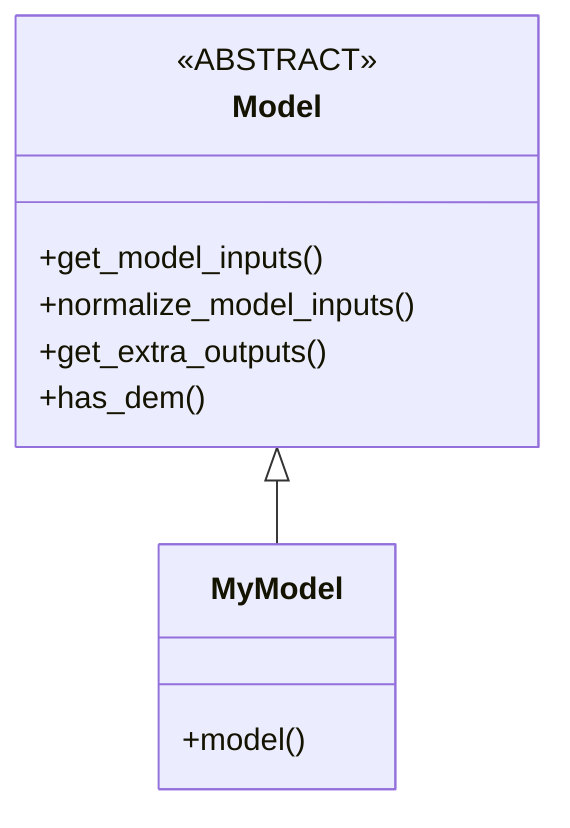

This document explains how to use Decloud, to train models and perform inference on images.

# Part A: data preparation

The following steps are explained:
- Prepare images and data prior to images pre-processing,
- Sentinel images pre-processing,
- Patches sampling

## How must be stored the input data?

We can distinguish three main kind of data to be used for the training process:
- Sentinel images: remote sensing images
- ROIs: some binary images used to select training and validation areas
- DEM: optional elevation images, used as additional input for models

The following subsections describe how the input data must be stored.

### Sentinel images

This section presents how the Sentinel images must be stored.
The decloud program uses two types of images:
- Sentinel-1 SAR images, pre-processed using the S1Tiling OTB Remote Module
- Sentinel-2 optical images, as shipped from the THEIA Land Data Center (L2 level)

These images must be in GeoTIFF format and organized as follows:

1. A **top folder** containing the images of the same type: radar or optical (e.g. **S1_PREPARE** and **S2_PREPARE**)
2. Inside the top folder, subdirectories named after the Sentinel-2 **tile name** (e.g. **T31TEJ**)
3. Inside the tile folder, we finally have the Sentinel products, as folder for Sentinel-2 images, and GeoTiff for Sentinel-1 images.

Below is an example for the Sentinel-1 and Sentinel-2 images:

#### Sentinel-1

Sentinel-1 images are just S1Tiling outputs (vv+vh) dumped in the right tile folder.

```
SENTINEL1
└───T30PVT
│   │   s1a_30PVT_vv_ASC_045_20170407t182729.tif
│   │   s1a_30PVT_vh_ASC_045_20170407t182729.tif
│   │   s1b_30PVT_vv_ASC_147_20200428t181838.tif
│   │   ...
│   
└───T31TEK
    │   s1b_31TEK_vv_DES_139_20200919t054329.tif
    │   ...
```

#### Sentinel-2

Sentinel-2 images are just the THEIA L2 products folders dumped into the right tile folder.

```
SENTINEL2
└───T30TEJ
│   └───SENTINEL2B_20180619-103559-594_L2A_T31TEJ_D_V1-8
│       │   SENTINEL2B_20180619-103559-594_L2A_T31TEJ_D_V1-8_FRE_B2.tif
│       │   SENTINEL2B_20180619-103559-594_L2A_T31TEJ_D_V1-8_FRE_B3.tif
│       │   SENTINEL2B_20180619-103559-594_L2A_T31TEJ_D_V1-8_FRE_B4.tif
│       │   SENTINEL2B_20180619-103559-594_L2A_T31TEJ_D_V1-8_FRE_B8.tif
│       │   ...
│       │   └───MASKS
│       │       │   SENTINEL2B_20180619-103559-594_L2A_T31TEJ_D_V1-8_CLM_R1.tif
│       │       │   ...
│   └───SENTINEL2B_20180625-105253-379_L2A_T31TEJ_D_V1-8
│       │   ...
└───T30TEK
│   └───SENTINEL2B_20180619-103349-564_L2A_T31TEK_D_V1-8
│       │   ...
```


### ROIs

The ROIs images are used to select the areas for the different datasets (e.g. train, valid, test, etc).
They are binary images telling when an image patch should be used in datasets, where 0 means the patch should not be considered and 1 when the patch should.
The ROI images **must have a physical spacing corresponding to 64 pixels of the Sentinel-2 image**, because one 
pixel refers to one elementary (i.e. the smallest possible) Sentinel-2 image patch, which is **64** as default in decloud.

ROIs are GeoTIFF images named after the Sentinel tile, and the dataset name (e.g. "train" or "valid").

```
ROI_Example
│   T30TXQ_train.tif
│   T30TXQ_valid.tif
│   ...

```

Take care to name the images properly, using the **Txxxxx_train.tif** **Txxxxx_valid.tif** pattern, where **xxxx** is the tile ID.

We finally have to create a JSON file that summarizes the ROIs files of **ROI_Example** on our filesystem:

File **roi_example.json**:

```
{
  "ROIS_ROOT_DIR": "/data/decloud/bucket/ROI/ROI_Example",
  "TRAIN_TILES": ["T31TCH", "T31TCJ", "T31TCK", "T31TDH", "T31TDJ", "T31TDK", "T31TEJ", "T31TEK", "T31TFJ", "T31TFK"],
  "VALID_TILES": ["T31TEJ", "T31TDH", "T31TDJ", "T31TDK"]
}
```

### DEMs (optional)

DEM (Digital Elevation Model) is optional.
DEM must be provided for each tile, when used.

They must be stored in a single folder, in geotiff format, named after the Sentinel-2 tile name:

```
DEM
│   T30TXQ.tif
│   T31TEJ.tif
│   ...

```

## Images pre-processing

This section will present the required preprocessing on the raw data.
Decloud needs to pre-process Sentinel images for various reasons:
1. Compress and optimize the Sentinel-1 and Sentinel-2 images, 
2. Collect statistics in elementary patches of images (elementary patches size is **64** as default in decloud): cloud percentage and validity.

A possible future improvement of decloud could be to avoid the Sentinel-1 and Sentinel-2 images conversion, and focus only on the statistics collect.

### Sentinel-1

Pre-processing steps of one Sentinel-1 image are the following:
1. merge the 'vv' and 'vh' channels
2. convert the values into dB scale
3. linearly stretch the dB values to exploit at best the uint16 encoding.
4. Compute statistics on patches: patch validity (0: not valid, 1: valid) which creates an additional output raster.


The `sentinel1_prepare.py` program takes cares of this.


```console
python3 preprocessing/sentinel1_prepare.py \
  --input_s1_vh /home/user/SENTINEL1/T30PVT/s1a_30PVT_vh_ASC_045_20170407t182729.tif \
  --out_s1_dir /data/decloud/bucket/S1_PREPARE/
```

Where:
* '--input_s1_vh' takes as parameter the vh image
* '--out_s1_dir' the output directory for the processed Sentinel-1 image

### Sentinel-2

Pre-processing steps for Sentinel-2 images are the following:
1. Concatenate channels: two rasters at 10m and 20m are produced
2. Compute statistics on patches, which creates two additional output rasters:
    - Cloud percentage
    - Patch validity (0: not valid, 1: valid)

This is done with the `sentinel2_prepare.py` program:

```console
python3 preprocessing/sentinel2_prepare.py \
  --in_image /home/user/s2_theia/T30TEJ/SENTINEL2B_20180619-103559-594_L2A_T31TEJ_D_V1-8/ \
  --out_s2_dir /data/decloud/bucket/S2_PREPARE/T31TEJ
```

Where :
* '--in_image' takes as parameter the directory containing the Sentinel-2 product
* '--out_s2_dir' the path of the folder where preprocessed images will be saved.

Note that you also can use compressed Sentinel-2 products:

```console
python3 preprocessing/sentinel2_prepare.py \
  --in_image /home/user/s2_theia/T30TEJ/SENTINEL2B_20180619-103559-594_L2A_T31TEJ_D_V1-8.zip \
  --out_s2_dir /data/decloud/bucket/S2_PREPARE/T31TEJ
```

### ROIs binary images

In decloud, ROIs are used to locate areas used for tranining and for validation.
Decloud computes Sentinel images statistics on elementary patches of **64x64** pixels size.
Thus ROIs are rasters containing 0 (out-of-ROI) or 1 (inside-ROI) for each elementary patch of Sentinel image.
These ROIs rasters are hence **binary images** which have a pixel spacing corresponding to **64 times** the original Sentinel image pixel spacing.

#### Generate the files

You can generate the ROI masks using the `preprocessing/generate_roi_rasters.py` script.
This script generates binary images for each datasets (e.g. train, valid, test). You can consider as many datasets as you want (e.g. valid1, valid2, testN...).
Optionnaly, you can provide vector files for each dataset (e.g. train, valid or test).

Here is an example how to generate ROI for 3 datasets: train (90%), valid (5%), and test (5%):

```console
python3 preprocessing/generate_roi_rasters.py \
  --tiles /home/user/tiles.json \
  --datasets train valid test \
  --props 90 5 5 \
  --output_dir /home/user/ROI
```

Note the you can append `--rois /home/user/vectors/train.gpkg /home/user/vectors/valid.gpkg /home/user/vectors/test.gpkg` to tell the application to select patches lying inside the designated vector files. If not provided, all the locations of the patches grid will be considered.

The program will create the '.tif' files corresponding to the validation and training ROIs in the output folder:

```
ROI
│   T31TEJ_train.tif
│   T31TEJ_valid.tif
│   T31TEJ_test.tif
```

To train models in decloud, you must have at least one "train" and one "valid" dataset.

#### Summarize the files

You must summarize the generated ROI files across your filesystem, in a JSON file, in the following way:

File **rois.json**:

```
{
  "ROIS_ROOT_DIR": "/home/user/ROI",
  "TRAIN_TILES": ["T31TEJ", "T31TDH", "T31TDJ", "T31TDK"],
  "VALID_TILES": ["T31TEJ", "T31TDH", "T31TDJ", "T31TDK"]
}
```

TRAIN is for the training dataset, VALID is for the dataset on which the validation metrics are computed.

## Patches sampling

The second step to be performed before sampling our pre-processed images, is to describe the way we want our images, in term of acquisition layout.

### The `AcquisitionsLayout`

An `AcquisitionsLayout` describes the layout of multiple Sentinel acquisitions, relatively to one reference scene, with respect to the acquisition characteristics.
These characteristics are the minimum and maximum time between acquisition dates (relatively to the reference), the cloud coverage of 
the optical image of one *acquisition*, the maximum gap between one optical *acquisition* and its SAR counterpart, etc.
It allows to describe various schemes of acquisition, enabling to sample patches in Sentinel images, which have specific acquisition layout.

Programmatically, an `AcquisitionsLayout` is a dictionary composed of one or more *acquisitions*, one *acquisition* being either one S1, one S2, or one S1-S2 pair.

The highest level key corresponds to the *acquisition* identifier (for instance, *t-1*).
The `AcquisitionsLayout` defines how the images are acquired in the time domain, relatively to one reference *acquisition*.

To specify the reference *acquisition*, we add the parameter `timeframe_origin=True` in the reference *acquisition* dictionary.
The `timeframe_start_hours` and `timeframe_end_hours` of other *acquisition* are relative to the reference *acquisition*. 

It's possible to define an acquisition layout from python code or via a JSON file.

#### How to instantiate an `AcquisitionsLayout` from Python

The file allowing to define the acquisition layout from python code is the file `sensing_layout.py`. 

Below is an example to define an `AcquisitionsLayout`:

```
    from acquisitions.sensing_layout import S1Acquisition, S2Acquisition, AcquisitionsLayout
    
    acq = AcquisitionsLayout()

    # One cloud-free acquisition at t-1 (we use "tm1" to avoid the +-/* characters)
    acq.new_acquisition("tm1",
                        s2_acquisition=S2Acquisition(min_cloud_percent=0, max_cloud_percent=0),
                        timeframe_start_hours=-5 * 24,
                        timeframe_end_hours=-15 * 24)
                        
    # One cloudy acquisition at t (this is our reference acquisition, we set timeframe_origin to True)
    acq.new_acquisition("t",
                        s1_acquisition=S1Acquisition(),
                        s2_acquisition=S2Acquisition(min_cloud_percent=50, max_cloud_percent=100),
                        max_s1s2_gap_hours=24,
                        timeframe_origin=True)
                        
    # Another cloud-free acquisition at t+1
    acq.new_acquisition("tp1",
                        s2_acquisition=S2Acquisition(min_cloud_percent=0, max_cloud_percent=0),
                        timeframe_start_hours=5 * 24,
                        timeframe_end_hours=15 * 24)

```

In this example, our `AcquisitionsLayout` is composed of three acquisitions named "*t-1*", "*t*" and "*t+1*".
The "*t*" acquisition is our reference acquisition, as specified by the parameter `timeframe_origin=True`, and is composed of
a Sentinel-2 image and a Sentinel-1 image. The gap between these two images should not exceed 24 hours and the S2 image
must not contain cloud. 
The "*t-1*" and "*t+1*" acquisitions are only composed of a Sentinel-2 image with no clouds in a period 
compared to the reference acquisition.


#### How to instantiate an `AcquisitionsLayout` from JSON

We can define an `AcquisitionsLayout` from a JSON file.
In the example below, we have defined the same `AcquisitionsLayout` seen before in JSON format :

```yaml
{
  "tm1" : {
    "acquisition" : {
      "S2" : {
        "type": "S2",
        "min_cloud_percent": 0,
        "max_cloud_percent": 0
      }
    },
    "timeframe_start_hours" : -120,
    "timeframe_end_hours" : -360
  },
  "t" : {
    "acquisition" : {
      "S2" : {
        "type": "S2",
        "min_cloud_percent": 50,
        "max_cloud_percent": 100
      },
      "S1" : {
        "type": "S1"
      }
    },
    "max_s1s2_gap_hours" :24,
    "timeframe_origin" : "True"
  },
  "tp1" : {
    "acquisition" : {
      "S2" : {
        "type": "S2",
        "min_cloud_percent": 0,
        "max_cloud_percent": 0
      }
    },
    "timeframe_start_hours" : 120,
    "timeframe_end_hours" : 360
  }
}
```

The `acquisition_factory` enables to instantiate an `AcquisitionsLayout` from a JSON file.

To do this, you need to load the python module :

`from acquisitions.acquisition_factory import AcquisitionFactory`

Then, it is enough to indicate to the factory the path to the JSON file defining the layout acquisition in the following way:

`acquisitions = AcquisitionFactory.get_acquisition(acquisition_layout)`

The factory will read the JSON file and instantiate the `AcquisitionsLayout` with the parameters defined in it.

### `AcquisitionsLayout` options

It is also possible to specify particular options such as `sibling`.
This option is a list of list containing the keys of the acquisitions that can be matched.
For example, if you specify that the acquisitions `t` and `target` can be siblings,
and if a sample containing an image belonging to these two acquisitions exists,
it will be kept and used for both `t` and `target`. If the option is not specified, 
this sample is rejected to avoid duplicate the image in  `t` and `target`.
Using `sibling` enables, for instance, to train networks with an identity mapping between
source and target.

### Create the TFRecords

Decloud uses TFRecords to store the images patches sampled in the images.

TFRecords are a native Tensorflow data type. Use of TFRecords allows for better I/O performance during training 
especially on high performance computing architectures.
TFRecords contain samples, which are composed of a corresponding image per key present in the `AcquisitionsLayout`.

We use all the data presented in the previous sections (pre-processed images, ROIs, acquisition layout JSON files) to generate samples from the images.

#### The `create_tfrecords.py` application parameters

Creation of TFRecords is done in the following way:
```console
python3 models/create_tfrecords.py \
  --acquisition_train acquisitions/AL-Meraner-1.json \
  --output_train /data/decloud/bucket/TFRecords/Occitanie/Meraner/train \
  --acquisitions_valid acquisitions/AL-Meraner-1.json \
  --outputs_valid /data/decloud/bucket/TFRecords/Occitanie/Meraner/valid \
  --tiles /data/decloud/bucket/dataset_occitanie.json \
  --rois /data/decloud/bucket/roi_occitanie_meraner.json \
  --patchsize 256 \
  --n_samples_per_shard 100 
```

Where the basic options are : 
* `acquisition_train` is the path to the training acquisition layout (JSON file), 
* `output_train` is the directory for output training TFRecords, 
* `acquisitions_valid` is the path to the validation acquisition layout (JSON files), 
* `outputs_valid` directory or directories for the output validation TFRecords, 
* `tiles` JSON file describing where pre-processed Sentinel images are stored, 
* `rois` JSON file describing where ROIs are stored,
* `patchsize` is the patch size, is pixels. Note that **it can only takes values that are a multiple of 64**.
* `n_samples_per_shard` is the number of sample in each TFRecord shard.

Type `python3 models/create_tfrecords.py --help` to show all options.

#### Generated files

Generated TFRecords will be created in the output directories with an incremental name (0.records, 1.records, ...).
One output repository will be created for each acquisition layout. 
Two additional files will also be created: one containing the type of data, the other will contain the shape of the data.
 
# Part B: Training

Now that we have prepared the TFRecords containing the images patches, we can train models.

## How to implement a new model

Thanks to the model factory, it's easy to implement and use a new model.
The new model (`MyModel`) must inherit from the `Model` abstract class (see `Model.py`) and must be located in the `model` folder.

The new `MyModel` class must implement the `model` function, that defines the network architecture.



### Run the training and validation iterations

The `train_from_tfrecords.py` allows to train and compute metrics on the validation datasets.
Models can be trained using the following command: 

```console
python3 models/train_from_tfrecords.py \
  --training_record /data/decloud/bucket/TFRecords/Occitanie/Meraner/train/ \
  --valid_records /data/decloud/bucket/TFRecords/Occitanie/Meraner/valid/ /data/decloud/bucket/TFRecords/Occitanie/Meraner/minitrain/ \
  --model meraner_os2 \
  -lr 0.00007 \
  -bt 4 \
  -bv 4 \
  -e 200 \
  --save_ckpt_dir /home/user/meraner/ckpt/ \
  --load_ckpt_dir /home/user/meraner/ckpt/ \
  --logdir /home/user/meraner/logdir/ \
  --previews
```

Where : 
* `training_record` is the path to the training TFRecords directory, 
* `valid_records` is a list of one or multiple paths to the validation TFRecords directories, 
* `model` or `m` is the name of the model used, 
* `lr` is the learning rate, 
* `bt` is the batch size for training, 
* `bv` is the batch size for validation, 
* `save_ckpt_dir` is the path to save checkpoint, 
* `load_ckpt_dir` is the path to load checkpoints, or the .meta file of a specific checkpoint,
* `logdir` is the path to save tensorboard logs, 

Optional parameters : 
* `all_metrics` to compute SSIM and SAM in addition to PSNR and MSE after each epoch,
* `previews` to generate previews in tensorboard after each epoch,
* `valid_only` to run only a validation step, 
* `out_savedmodel` to export a trained model into a **SavedModel** (which can be used later to process real world images).

## Inference

Once the model has been trained and exported using the `out_savedmodel` parameter, it can be used in production. 

For instance, we use `crga_processor.py` to perform the inference of the *crga* models (i.e. models which inherit from `crga_os1_base` and `crga_os2_base`).
This program not only performs the inference, but also takes care of preparing the right input images to feed the model, and also the post-processing steps (like removing inferred no-data pixels).
It is built exclusively using OTB application pipelines, and is fully streamable (not limitation or images size).

Below is an example of use : 

```yaml
python production/crga_processor.py \
--il_s1before \
  /data/decloud/bucket/S1_PREPARE/T31TEJ/s1b_31TEJ_vvvh_DES_139_20201001txxxxxx_from-10to3dB.tif \
  /data/decloud/bucket/S1_PREPARE/T31TEJ/s1a_31TEJ_vvvh_DES_037_20200930txxxxxx_from-10to3dB.tif \
  /data/decloud/bucket/S1_PREPARE/T31TEJ/s1b_31TEJ_vvvh_DES_110_20200929t060008_from-10to3dB.tif \
--il_s1 \
  /data/decloud/bucket/S1_PREPARE/T31TEJ/s1b_31TEJ_vvvh_DES_139_20201013txxxxxx_from-10to3dB.tif \
  /data/decloud/bucket/S1_PREPARE/T31TEJ/s1b_31TEJ_vvvh_DES_110_20201011t060008_from-10to3dB.tif \
  /data/decloud/bucket/S1_PREPARE/T31TEJ/s1a_31TEJ_vvvh_DES_037_20201012txxxxxx_from-10to3dB.tif \
--il_s1after \
  /data/decloud/bucket/S1_PREPARE/T31TEJ/s1b_31TEJ_vvvh_DES_139_20201025txxxxxx_from-10to3dB.tif \
  /data/decloud/bucket/S1_PREPARE/T31TEJ/s1a_31TEJ_vvvh_DES_037_20201024txxxxxx_from-10to3dB.tif \
  /data/decloud/bucket/S1_PREPARE/T31TEJ/s1b_31TEJ_vvvh_DES_110_20201023t060008_from-10to3dB.tif \
--il_s2before \
  /data/decloud/bucket/S2_PREPARE/T31TEJ/SENTINEL2B_20200929-104857-489_L2A_T31TEJ_C_V2-2 \
  /data/decloud/bucket/S2_PREPARE/T31TEJ/SENTINEL2B_20200926-103901-393_L2A_T31TEJ_C_V2-2 \
--il_s2after \
  /data/decloud/bucket/S2_PREPARE/T31TEJ/SENTINEL2B_20201026-103901-924_L2A_T31TEJ_C_V2-2 \
  /data/decloud/bucket/S2_PREPARE/T31TEJ/SENTINEL2A_20201024-104859-766_L2A_T31TEJ_C_V2-2 \
--in_s2 /data/decloud/bucket/S2_PREPARE/T31TEJ/SENTINEL2B_20201012-105848-497_L2A_T31TEJ_C_V2-2 \
--dem /data/decloud/bucket/DEM_PREPARE/T31TEJ.tif \
--savedmodel /data/decloud/todel/savedmodel_david2/09-04-21_224907_various_enhancements_and_todos_93228_crga_os2_david_bt48_bv48 \
--output /data/decloud/results/theia_data/SENTINEL2B_20201012-105848-497_L2A_T31TEJ_C_V2-2_FRE_10m_reconst_reference.tif
```

